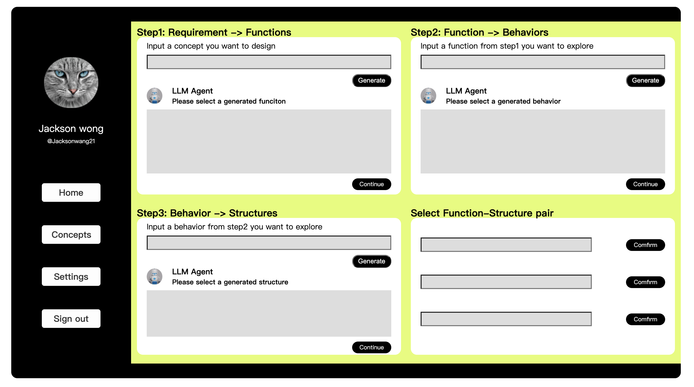

# Towards Guidable Generative Design: A Concept Generation Approach by Reasoning FBS Ontology Using Large Language Model

## Introduction

Recent research in the field of design engineering is more or less focusing on using AI technologies such as Large Language Models (LLMs) to assist early stage design. The engineer or designer can use LLMs to explore, validate and compare thousands of generated conceptual stimuli and make final choices. This was seen as a significant stride in advancing the status of the generative approach in computer-aided design. However, it is often difficult to instruct LLMs to obtain conceptual solutions been novel and requirement-compliant in real design tasks, due to the lack of transparency and insufficient controllability of LLMs. This paper presents an approach to leverage LLMs to infer Function-Behavior-Structure (FBS) ontology for high-quality design concepts. Prompting design based on the FBS model decomposes the design task into three sub-tasks including functional, behavioral, and structural reasoning. In each sub-task, prompting templates and specification signifiers are specified to guide the LLMs to generate concepts. Human can determine the selected concepts by judging and evaluating the generated function-structure pairs. A comparative experiment has been conducted to evaluate the concept generation approach. The results indicate that our approach achieves the highest scores in concept evaluation. Generated concepts are more reasonable and creative compared to the baseline.

We proposed a framework for explicitly prompting the LLM to decompose responses into the FBS ontological framework, which has been illustrated in this Figure. Prompt templates and specification signifiers are used to guide the model to reason the design problem at the different generative stages correctly and controllably. The sub-prompt templates correspond to the three mapping stages of FBS, including requirement to function (R->F), Function to Behavior (F->Be), and Behavior to Structure (Be->S). In contrast to the previous LLM based generative design, a designer can filter the generated content at each stage of the generation process, thus incorporating human interpretation of the design representation. To help designers better leverage the generated descriptions, understanding the relationship between functions and structures in the FBS model is necessary. Therefore, the functional contents generated in R->F Mapping and the corresponding structural contents generated in B->S Mapping are organized into paired 'function-structure' stimuli. The designer can evaluate novel and reasonable design structure suggestions based on the potential functions needed for a design requirement. The generated stimuli of concepts are the result of human-computer collaboration, which enable a designer to use them for creative and reasonable conceptual design in the phase of ideation.
![The FBS-based task-decomposed approach for generative conceptual design. In generation phase, designer initially input requirements to LLM. The LLM will inference design concepts from Function, Behavior, to Structure through FBS process, and designer can filter the generated content at each stage of the generation process. Once LLM finish the reasoning, designer will choose the functions that they think to be good, and the structures that can meet the corresponding function. Then the paired Function-Structure will be used as design stimuli to inspire designer create conceptual design sketch in design phase.](framework.png)

## Usage

### Create environment

To create a virtual environment, Python supplies a built in venv module which provides the basic functionality needed for the virtual environment setup. Running the command below will create a virtual environment named "openai-env" inside the current folder you have selected in your terminal / command line:

```shell
python -m venv env
```

Once you’ve created the virtual environment, you need to activate it. On Windows, run:

```shell
env\Scripts\activate
```

On Unix or MacOS, run:

```shell
source env/bin/activate
```

### Installation

Once you have Python 3.7.1 or newer installed and (optionally) a virtual environment setup, the project dependencies library can be installed. From the terminal / command line, run:

```shell
pip install -r requirements.txt
```

Setup your API key for projects:

```shell
export OPENAI_API_KEY='your-api-key-here'
```

### Run

Enter the project file and run the run.py file

```shell
python run.py
```

The project running interface diagram is as follows.

